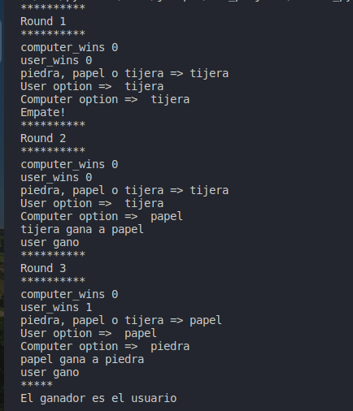

_ejercicios practicos en python donde se repasan los fundamentos del lenguaje de programación_
Elaborado por ***José Maya*** para la plataforma Ada School

El archivo principal contiene el codigo de un programa donde el user elije piedra, pápel o tijera frente a una elección aleatoria de la maquina.

### Jerarquia Operadores aritméticos
P - paréntesis
E - exponentes
M - multiplicación
D - división
A - adición
S - sutracción

